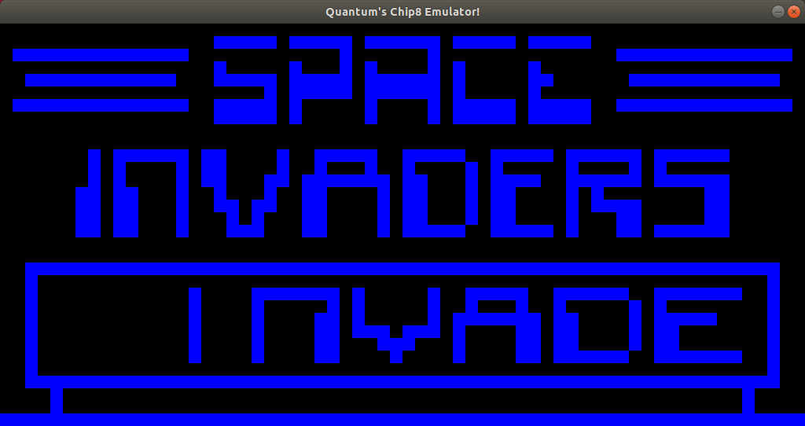

## Chip8-Emulator
A Chip8 Emulator written in C++


*SPACE INVADERS*


*WIPEOFF*

CHIP-8 is an interpreted programming language orginally developed by Joseph Weisbecker. It was initially used on the COSMAC VIP and Telmac 1800 8-bit microcomputers in the mid-1970s. CHIP-8 programs are run on a CHIP-8 virtual machine. It was made to allow video games to be more easily programmed on these computers (source wiki). 

## Pre-reqs

Requires Make and SDL2:
```
$ sudo apt-get update
$ sudo apt-get install make
```

For those who have Advanced Packaging Tool available (i.e., Ubuntu, Debian, etc), you'll want to search the apt-get cache and find the current SDL2 version to install.  Use the command:
```
$ apt-cache search libsdl2
```
You'll want to download the development version of SDL2 and SDL2-mixer (audio library for sound). As of last update of this README, the development package(s) are libsdl2-dev and libsdl2-mixer-dev.  Use command:
```
$ sudo apt-get install libsdl2-dev libsdl2-mixer-dev
```

## Cloning, compiling and running

Clone and Compile:
```
$ git clone https://github.com/erick-santiago/Chip8-Emulator.git
$ cd Chip8-Emulator
$ make
```

Run:
```
$ ./testing_Chip8 ROMs/ROM-NAME-HERE
(example: ./testing_Chip8 ROMs/WIPEOFF)
```
The ROMs are included in the `ROMs` directory.

## References
Resources used to bring this project to life, and special thanks:

- http://www.multigesture.net/articles/how-to-write-an-emulator-chip-8-interpreter/
- http://devernay.free.fr/hacks/chip8/C8TECH10.HTM
- https://lazyfoo.net/tutorials/SDL/

## License
This project is licensed under the terms of the MIT license.
